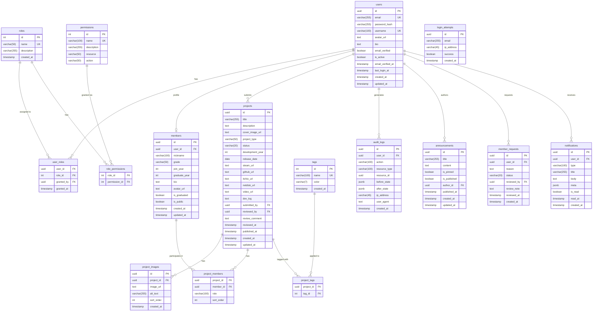

# 数据库设计文档

**版本**: 1.0.0  
**数据库**: PostgreSQL 15+  
**ORM**: Prisma

---

## ER 图 (Mermaid)



---

## Prisma Schema

```prisma
// prisma/schema.prisma

generator client {
  provider = "prisma-client-js"
}

datasource db {
  provider = "postgresql"
  url      = env("DATABASE_URL")
}

model User {
  id                String    @id @default(uuid())
  email             String    @unique @db.VarChar(255)
  passwordHash      String    @db.Text
  username          String    @unique @db.VarChar(100)
  avatarUrl         String?   @db.Text
  bio               String?   @db.Text
  emailVerified     Boolean   @default(false)
  isActive          Boolean   @default(true)
  emailVerifiedAt   DateTime?
  lastLoginAt       DateTime?
  createdAt         DateTime  @default(now())
  updatedAt         DateTime  @updatedAt

  userRoles         UserRole[]
  member            Member?
  submittedProjects Project[]        @relation("SubmittedBy")
  reviewedProjects  Project[]        @relation("ReviewedBy")
  auditLogs         AuditLog[]
  announcements     Announcement[]   @relation("AnnouncementAuthor")
  memberRequest     MemberRequest[]
  notifications     Notification[]
  grantedRoles      UserRole[]       @relation("GrantedBy")
  reviewedRequests  MemberRequest[]  @relation("ReviewedBy")

  @@index([email])
  @@index([username])
  @@map("users")
}

model Role {
  id          Int      @id @default(autoincrement())
  name        String   @unique @db.VarChar(50)
  description String?  @db.VarChar(255)
  createdAt   DateTime @default(now())

  userRoles       UserRole[]
  rolePermissions RolePermission[]

  @@map("roles")
}

model Permission {
  id          Int    @id @default(autoincrement())
  name        String @unique @db.VarChar(100)
  description String? @db.VarChar(255)
  resource    String @db.VarChar(50)
  action      String @db.VarChar(50)

  rolePermissions RolePermission[]

  @@map("permissions")
}

model UserRole {
  userId    String   @db.Uuid
  roleId    Int
  grantedBy String?  @db.Uuid
  grantedAt DateTime @default(now())

  user      User @relation(fields: [userId], references: [id], onDelete: Cascade)
  role      Role @relation(fields: [roleId], references: [id])
  grantor   User? @relation("GrantedBy", fields: [grantedBy], references: [id])

  @@id([userId, roleId])
  @@map("user_roles")
}

model RolePermission {
  roleId       Int
  permissionId Int

  role       Role       @relation(fields: [roleId], references: [id])
  permission Permission @relation(fields: [permissionId], references: [id])

  @@id([roleId, permissionId])
  @@map("role_permissions")
}

model Member {
  id           String   @id @default(uuid())
  userId       String   @unique @db.Uuid
  nickname     String   @db.VarChar(100)
  grade        String?  @db.VarChar(50)
  joinYear     Int
  graduateYear Int?
  bio          String?  @db.Text
  avatarUrl    String?  @db.Text
  isGraduated  Boolean  @default(false)
  isPublic     Boolean  @default(true)
  createdAt    DateTime @default(now())
  updatedAt    DateTime @updatedAt

  user            User             @relation(fields: [userId], references: [id])
  projectMembers  ProjectMember[]

  @@index([joinYear])
  @@map("members")
}

enum ProjectType {
  STEAM_PUBLISHED
  INDIE_GAME
  GAME_JAM
  DEMO
  GRADUATION_PROJECT
  PROTOTYPE
}

enum ProjectStatus {
  DRAFT
  PENDING_REVIEW
  PUBLISHED
  REJECTED
}

model Project {
  id              String        @id @default(uuid())
  title           String        @db.VarChar(255)
  description     String        @db.Text
  coverImageUrl   String        @db.Text
  projectType     ProjectType
  status          ProjectStatus @default(DRAFT)
  developmentYear Int
  releaseDate     DateTime?     @db.Date
  steamUrl        String?       @db.Text
  githubUrl       String?       @db.Text
  itchioUrl       String?       @db.Text
  netdiskUrl      String?       @db.Text
  videoUrl        String?       @db.Text
  devLog          String?       @db.Text
  submittedById   String?       @db.Uuid
  reviewedById    String?       @db.Uuid
  reviewComment   String?       @db.Text
  reviewedAt      DateTime?
  publishedAt     DateTime?
  createdAt       DateTime      @default(now())
  updatedAt       DateTime      @updatedAt

  submittedBy     User?          @relation("SubmittedBy", fields: [submittedById], references: [id])
  reviewedBy      User?          @relation("ReviewedBy", fields: [reviewedById], references: [id])
  images          ProjectImage[]
  projectMembers  ProjectMember[]
  projectTags     ProjectTag[]

  @@index([status])
  @@index([projectType])
  @@index([developmentYear])
  @@index([publishedAt])
  @@map("projects")
}

model ProjectImage {
  id        String   @id @default(uuid())
  projectId String   @db.Uuid
  imageUrl  String   @db.Text
  altText   String?  @db.VarChar(255)
  sortOrder Int      @default(0)
  createdAt DateTime @default(now())

  project   Project @relation(fields: [projectId], references: [id], onDelete: Cascade)

  @@index([projectId])
  @@map("project_images")
}

model ProjectMember {
  projectId String @db.Uuid
  memberId  String @db.Uuid
  role      String @db.VarChar(100)
  sortOrder Int    @default(0)

  project   Project @relation(fields: [projectId], references: [id], onDelete: Cascade)
  member    Member  @relation(fields: [memberId], references: [id])

  @@id([projectId, memberId])
  @@map("project_members")
}

model Tag {
  id        Int      @id @default(autoincrement())
  name      String   @unique @db.VarChar(100)
  color     String   @default("#6366f1") @db.VarChar(7)
  createdAt DateTime @default(now())

  projectTags ProjectTag[]

  @@map("tags")
}

model ProjectTag {
  projectId String @db.Uuid
  tagId     Int

  project   Project @relation(fields: [projectId], references: [id], onDelete: Cascade)
  tag       Tag     @relation(fields: [tagId], references: [id])

  @@id([projectId, tagId])
  @@map("project_tags")
}

model Announcement {
  id          String    @id @default(uuid())
  title       String    @db.VarChar(255)
  content     String    @db.Text
  isPinned    Boolean   @default(false)
  isPublished Boolean   @default(false)
  authorId    String    @db.Uuid
  publishedAt DateTime?
  createdAt   DateTime  @default(now())
  updatedAt   DateTime  @updatedAt

  author User @relation("AnnouncementAuthor", fields: [authorId], references: [id])

  @@index([isPinned, isPublished])
  @@map("announcements")
}

model AuditLog {
  id           String   @id @default(uuid())
  userId       String?  @db.Uuid
  action       String   @db.VarChar(100)
  resourceType String   @db.VarChar(100)
  resourceId   String?  @db.Uuid
  beforeState  Json?
  afterState   Json?
  ipAddress    String?  @db.VarChar(45)
  userAgent    String?  @db.Text
  createdAt    DateTime @default(now())

  user User? @relation(fields: [userId], references: [id])

  @@index([userId])
  @@index([resourceType, resourceId])
  @@index([createdAt])
  @@map("audit_logs")
}

model MemberRequest {
  id         String   @id @default(uuid())
  userId     String   @db.Uuid
  reason     String?  @db.Text
  status     String   @default("pending") @db.VarChar(20)
  reviewedBy String?  @db.Uuid
  reviewNote String?  @db.Text
  reviewedAt DateTime?
  createdAt  DateTime @default(now())

  user     User  @relation(fields: [userId], references: [id])
  reviewer User? @relation("ReviewedBy", fields: [reviewedBy], references: [id])

  @@index([status])
  @@map("member_requests")
}

model Notification {
  id        String   @id @default(uuid())
  userId    String   @db.Uuid
  type      String   @db.VarChar(100)
  title     String   @db.VarChar(255)
  body      String   @db.Text
  meta      Json?
  isRead    Boolean  @default(false)
  readAt    DateTime?
  createdAt DateTime @default(now())

  user User @relation(fields: [userId], references: [id], onDelete: Cascade)

  @@index([userId, isRead])
  @@map("notifications")
}

model LoginAttempt {
  id        String   @id @default(uuid())
  email     String   @db.VarChar(255)
  ipAddress String   @db.VarChar(45)
  success   Boolean
  createdAt DateTime @default(now())

  @@index([email, createdAt])
  @@index([ipAddress, createdAt])
  @@map("login_attempts")
}
```

---

## 索引设计说明

| 表 | 索引列 | 理由 |
|----|--------|------|
| users | email, username | 登录查询、唯一性检查 |
| projects | status, projectType, developmentYear, publishedAt | 作品库多维筛选 |
| project_images | projectId | 关联查询 |
| members | joinYear | 历史页按年分组 |
| audit_logs | userId, (resourceType, resourceId), createdAt | 审计查询三个维度 |
| notifications | (userId, isRead) | 未读通知列表 |
| login_attempts | (email, createdAt), (ipAddress, createdAt) | 暴力破解检测 |

---

## 种子数据 (Seed)

```typescript
// prisma/seed.ts
const roles = [
  { name: 'guest',    description: '游客，只读权限' },
  { name: 'user',     description: '注册用户' },
  { name: 'member',   description: '社团成员' },
  { name: 'reviewer', description: '审核员' },
  { name: 'admin',    description: '管理员，全权限' },
];

const permissions = [
  { name: 'project:read',   resource: 'project',   action: 'read' },
  { name: 'project:create', resource: 'project',   action: 'create' },
  { name: 'project:update_own', resource: 'project', action: 'update_own' },
  { name: 'project:update_any', resource: 'project', action: 'update_any' },
  { name: 'project:delete', resource: 'project',   action: 'delete' },
  { name: 'project:review', resource: 'project',   action: 'review' },
  { name: 'member:read',    resource: 'member',    action: 'read' },
  { name: 'user:manage',    resource: 'user',      action: 'manage' },
  { name: 'role:manage',    resource: 'role',      action: 'manage' },
  { name: 'announcement:manage', resource: 'announcement', action: 'manage' },
];
```
